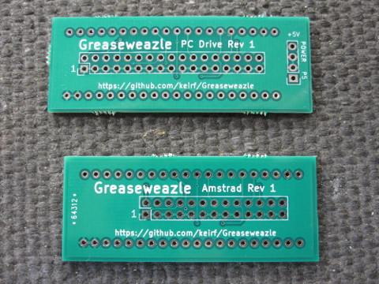
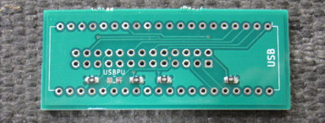
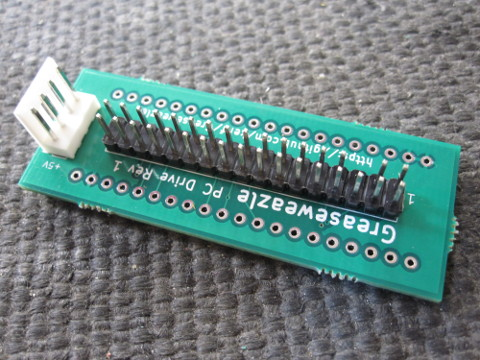
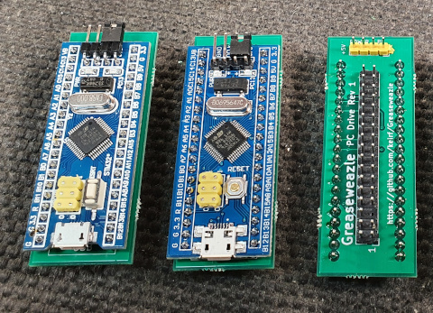

**NOTE: If you received a pre-assembled adapter then
you can skip straight to [Hardware Setup](Hardware-Setup).**

**NOTE: If you received a pre-programmed kit then
you can skip straight to [Through-Hole Assembly](#through-hole-assembly).**

- [Parts List](#parts-list)
- [SMT Assembly](#smt-assembly)
- [Through-Hole Assembly](#through-hole-assembly)
- [Firmware Programming](Firmware-Programming)

## Parts List

Directly connecting a "Blue Pill" to your floppy drive requires the
following parts:
- STM32 "Blue Pill" board
- Adapter PCB
- 2.54mm-pitch Male Header Pins
- 4 x 0805 1k resistors

The "Blue Pill" is available very cheaply from many Chinese Ebay
sellers for less than £2 including postage. The best search term is
"*STM32F103C8T6 board*", sorted by lowest price first, and look for a
board identical to below.

**UPDATE**: Please be aware of [fake STM32 chips](STM32-Fakes) flooding
the Chinese market. You may be advised to use a local source for your
Blue Pill: For example, in UK they can be purchased for £3-4, you can more
easily question a local seller, and you have wasted much less time if
your chip does turn out to be fake.

Two types of adapter PCB are available: One for 34-pin PC-compatible
floppy drives, the other for 26-pin 3-inch Amstrad drives (used in CPC
and Spectrum +3).

You can have the PCBs made yourself:

**DirtyPCBs:** The simplest method, using a [direct purchase
link][dirtypcbs] and costing approximately $25 in total. Once the
design is added to your cart, be sure to increase the *Size* to
*10x10*, or your order will be rejected! You can also choose *Color*,
and optionally increase *Thickness* to *1.6mm* without increasing
purchase cost. Your order will yield 10 PCBs, each containing 4 PC
34-pin adapters and 1 Amstrad 26-pin adapter: 50 in total!

**Custom order (Gerbers):** The Gerber sources for the 10x10cm panel
as in the above DirtyPCBs store link can be downloaded
[here](assets/adapter_rev1/F1_10x10_Gerbers.zip).

**Custom order (KiCad):** The original KiCad PCB design is available in my
[PCB Projects git repository][pcbprojects]. The single-board PC design
is available under *greaseweazle/*, the Amstrad design under *gw-26/*, and
the five-to-a-panel design (as in the DirtyPCBs store link) is under
*panels/GW*. You will need to use KiCad to generate Gerbers.

## SMT Assembly

Solder four 1k 0805 resistors to the adapter PCB, skipping the
location marked **USBPU**.

## Through-Hole Assembly

Solder male header pins to the floppy and power headers
(note that the power header is omitted on the Amstrad adapter). On the
PC adapter board I recommend that you remove header pin 5, as in the
picture below (be careful of orientation and pin numbering!). This
picture also illustrates use of a Berg power
connector in place of 1x4 header pins.

Be careful to solder the pins straight: You may wish to solder one pin
on each header, then heat that pin while ensuring the header is correctly
seated. It is very hard to adjust after all pins are soldered!

Now solder the pair of 20-pin header strips to the Blue Pill, making
sure they are straight, and solder the Blue Pill to the reverse side
of the adapter board. Please note:
* The Blue Pill is a tight fit to the adapter: Make
sure the pins are lined up, and expect to press firmly.
* Be careful not to press the Blue Pill fully flush with
the adapter as you will risk shorting the backsides of the two boards
against each other: Instead leave a small clearance of 1-2mm.
* Be sure to install your Blue Pill the right way round: The USB end is
marked on the adapter.

Ensure that the boot jumpers are both set to 0, otherwise the
Greaseweazle firmware will not run at power on. Note in the picture above
that this setting has been soldered on the underside of the Blue Pill, and
the boot jumper pins have been cropped: You do not need to do this.

[dirtypcbs]: https://dirtypcbs.com/store/designer/details/keirfraser/6387/greaseweazle-rev-1-panel
[pcbprojects]: https://github.com/keirf/pcb-projects
