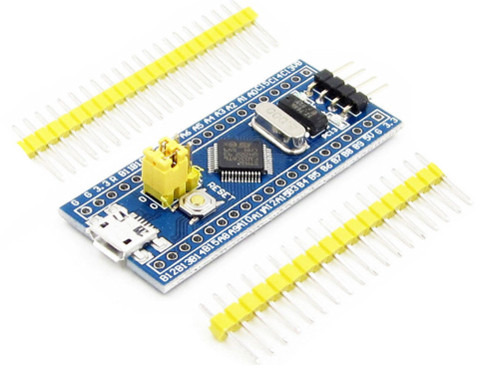
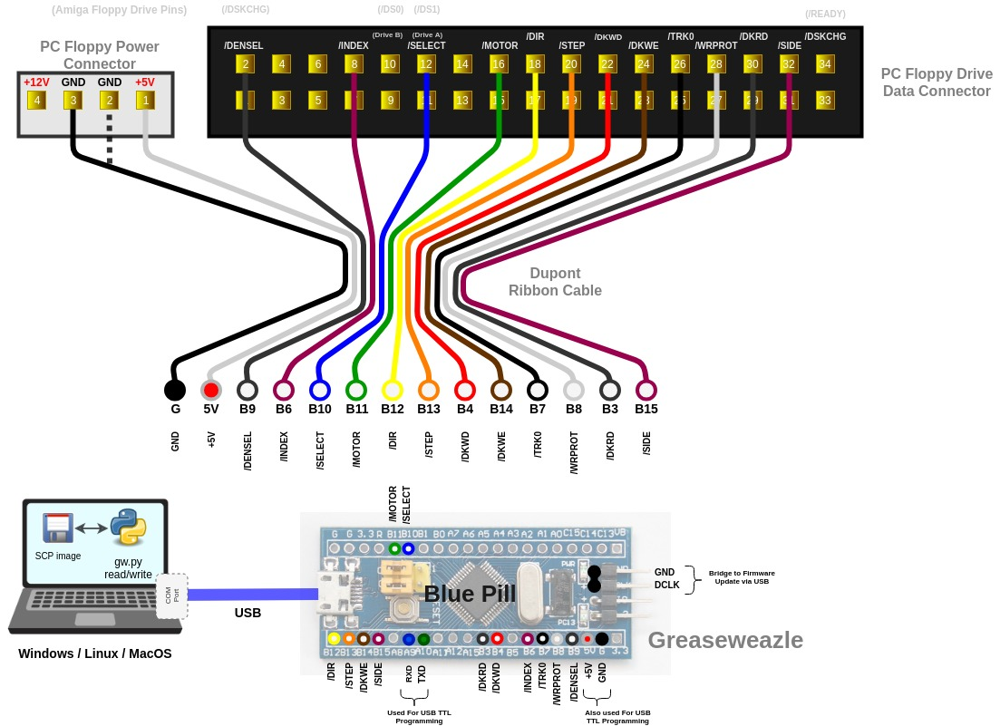

- [Parts List](#parts-list)
- [Firmware Programming](#firmware-programming)
- [Floppy Drive](#floppy-drive)
- [Host PC](#host-pc)

This method is *deprecated** and **unreliable** due to use of weak
Dupont connections. Do not expect support if your direct-connection
setup doesn't work!

## Parts List

Directly connecting a "Blue Pill" to your floppy drive requires the
following parts:
- STM32 "Blue Pill" board
- Dupont jumper wires (Female-Female)

The "Blue Pill" is available very cheaply from many Chinese Ebay
sellers for less than £2 including postage. The best search term is
"*STM32F103C8T6 board*", sorted by lowest price first, and look for a
board identical to below.

**UPDATE**: Please be aware of [fake STM32 chips](STM32-Fakes) flooding
the Chinese market. You may be advised to use a local source for your
Blue Pill: For example, in UK they can be purchased for £3-4, you can more
easily question a local seller, and you have wasted much less time if
your chip does turn out to be fake.

## Firmware Programming

Before programming your Blue Pill board you should solder the supplied
header pins.

Please see the [Firmware Programming page](Firmware-Programming) for
further instructions.

## Floppy Drive

You can connect the Blue Pill to any floppy drive implementing a Shugart
interface: Old PC 3.5-inch and 5.25-inch drives are a good choice,
or an Amstrad 3-inch drive for Amstrad CPC and Spectrum +3 disks.
Note that the drive need not be the same model as in the system
to which the disks belong: a Shugart drive is a Shugart drive, and
it only really matters that it takes the correct size physical media.

3.5-inch drives typically require only 5v power and can be supplied
directly from the 5-volt pin on the Greaseweazle board. Older
5.25- and 3-inch drives typically are more power hungry and require 12v
power too: These you must connect to a separate power source.

Connections are as follows, for a PC 34-pin drive and for an
Amstrad 26-pin drive:

| GW Pin | Signal | PC Pin | Ams Pin |
|--------|--------|--------|---------|
|  B9    | DENSEL |   2    |   -     |
|  B6    | INDEX  |   8    |   2     |
|  B10   | SELECT |  12    |   4     |
|  B11   | MOTOR  |  16    |   8     |
|  B12   | DIR    |  18    |  10     |
|  B13   | STEP   |  20    |  12     |
|  B4    | DKWD   |  22    |  14     |
|  B14   | DKWE   |  24    |  16     |
|  B7    | TRK0   |  26    |  18     |
|  B8    | WRPROT |  28    |  20     |
|  B3    | DKRD   |  30    |  22     |
|  B15   | SIDE   |  32    |  24     |

Odd numbered pins may be connected to Ground on the Greaseweazle board.
It is mandatory to connect at least one odd-numbered pin if you are
using an external power source for your floppy drive, to connect the
ground planes of Greaseweazle and the drive.

See the following diagram showing the Dupont jumper connections.

[FULL RESOLUTION DIAGRAM HERE][hires]

In the above example please note that no odd-numbered 34w pins need be
connected to **GND** as grounds are already connected via the power
connector. This would not be the case if using an external power
source.

## Host PC

Connect to your host PC (Linux, Mac, Windows, etc) using a normal USB cable.
Greaseweazle appears as a serial or modem device, depending on your OS.

[hires]: https://github.com/keirf/greaseweazle/wiki/assets/dupont.jpg
