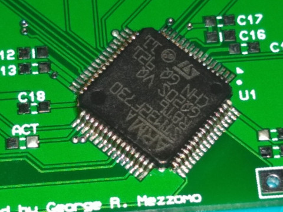

**NOTE: If you received a pre-assembled adapter then
you can skip straight to [Hardware Setup](Hardware-Setup).**

- [Parts List](#parts-list)
- [Assembly Guidance](#assembly-guidance)
- [Firmware Programming](Firmware-Programming)

## Parts List

You should obtain (or have received) the following parts, in addition
to the Greaseweazle PCB. Note that kits may include
an excess quantity of the "passives" (resistors, capacitors).

Board Reference | Footprint | Value/Type | Quantity
----------|------|-------|---------
C1        | 0805 | 4.7uF | 1
C2-C7,C10-C11,C13-C16 | 0603 | 100nF | 12
C8-C9,C12 | 0805 | 1uF   | 3
C17-C18   | 0603 | 27pF  | 2
C19-C20   | 0805 | 10uF  | 2
 | | | 
R1-R2     | 0603 | 470R  | 2
R3-R6     | 0603 | 1k    | 4
 | | | 
U1        | LQFP64 | STM32F730R8 | 1
U2        | SOT25 | AP2112K-3 | 1
 | | | 
ACT,PWR   | 0603 | LED | 2
DEBUG | 7x1 | Pin Header | 1
RESET, WRITE_INHIBIT | 2x1 | Pin Header | 2
FLOPPY POWER | 4x1 | TE 171826-4 | 1
FLOPPY DATA | 17x2 | Box Header | 1
USB       | USB-B | | 1
X1        | HC-49/US | 8MHz | 1

## Assembly Guidance

Please note that the small size and pitch of some components, particularly
U1, means that you will need some soldering proficiency, and
equipment such as the following:
- A workbench with decent lighting
- Moderate magnification (eg. a magnifying bench light)
- Good quality leaded (60/40) solder (eg. Stannol, Kester)
  - **Avoid lead-free solder!**
- Plenty of flux
- Tweezers

Although not a step-by-step guide, I will note some caveats.

1. The kit comes with the STM32 chip placed in a fold of antistatic
material, taped to the PCB. Be warned, the chip will be loose when you
peel the tape!

2. The kit-supplied LEDs are manufacturer codes HSMS-C190 and
HSMY-C190.  The cathode terminal is marked by a *tiny* dot, and should
be oriented towards the right-hand side of the PCB.
You can find the manufacturer datasheet
[here](https://docs.broadcom.com/docs/AV02-0551EN).

3. You may wish to remove pin 5 and/or pin 3 from the FLOPPY DATA header.
Some floppy-drive cables use one of these pins as an orientation key.

### STM32 Orientation

