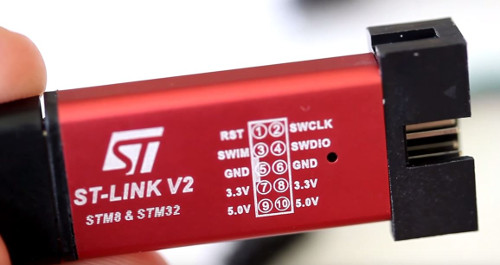

**NOTE: If you have a pre-assembled Greaseweazle device, or a kit
with the MCU pre-soldered, then it is already programmed and
you should skip this section!!**

- [**Programming V4 Devices via USB-DFU**](#programming-v4-devices-via-usb-dfu)
- [**Programming F1 and F7 Devices via ST-Link**](#programming-f1-and-f7-devices-via-st-link)

## Programming V4 Devices via USB-DFU

**WARNING:** All V4 devices are sold pre-programmed and end users should
only need to perform [firmware updates](Firmware-Update). However, the
reflashing process is documented here in case a V4 device is ever somehow
"bricked".

Firstly, the V4 board must be jumpered for programming mode:
- **V4:** Place a jumper across DFU and 3V3 pins on the 12-pin header block
- **V4 Slim:** Place a jumper across the BOOT pins on the 6-pin header block

Download and install the [ArteryISP software][arteryisp] (Windows
only) via the **Program and Debug** -> **ISP Programmer** download
link.

Download the latest firmware release from [here][dlfw].

Connect your V4 board to the Windows host machine, and run the ArteryISP
software.
- Select Port Type **USB DFU**
- Confirm that the V4 board is found and listed
- Click **Next** until you reach the screen including **Download to device**
- Click **Download to device**
- Click **Add** and select the **at32F4** hex file in the **hex/** subfolder of the firmware release
- Click **Next** and then **OK** at the read-protection warning that is shown
- Click **Close**, disconnect the V4 board, remove the programming jumper

## Programming F1 and F7 Devices via ST-Link

**WARNING:** Do not connect to the Greaseweazle USB port during
programming. Greaseweazle is powered by your programmer:
bad things may happen if you simultaneously provide USB power.

Programming requires an ST-Link v2 programmer, clones of which are
available cheaply on Ebay. The clones are recommended over the
official programmer because they are much cheaper, and because they
also power the board during programming; the official programmer requires
the Greaseweazle to be powered separately.

Connect the programmer to the **DEBUG** header of the F7 board, or the
right-angle four-pin header of the Blue Pill board:

Programmer | Blue Pill | F7 DEBUG
-----------|-----------|----------------
SWCLK | DCL | CK
SWDIO | DIO | DIO
GND   | GND | GND
3.3V  | 3.3 | 3V31
1. F7 PCB Rev 1: Pin is named VCC

**WARNING: Do not connect to the programmer's **5.0V** pin as you
will destroy your STM32 chip!**

**Windows:**
- Download the latest firmware zip file from [here][dlfw].
- Download and run the ST-Link software ([STSW-LINK004](https://www.st.com/en/development-tools/stsw-link004.html)).
- Connect your ST-Link programmer (**not** Greaseweazle!) to your Windows PC via USB.
- Click **Connect to the target** in the ST-Link software.
- Click **Open file**, navigate to the **hex/** subfolder, and open the correct hex file for your board
  - **f1** hex file for Blue Pill, **f7** hex file for F7 boards
- Click **Program verify**

**MacOS / Linux:**
- Download the latest firmware zip file from [here][dlfw].
- Install [stlink](https://github.com/stlink-org/stlink): `brew install stlink`
- Connect your ST-Link programmer (**not** Greaseweazle!) to your Mac via USB.
- Identify the correct hex file for your board in the **hex/** subfolder
  - **f1** hex file for Blue Pill, **f7** hex file for F7 boards
- Write the file: `st-flash --reset --format ihex write filename`
- Ensure no errors were reported

[arteryisp]: https://www.arterychip.com/en/support/tools.jsp
[dlfw]: https://github.com/keirf/greaseweazle-firmware/releases/latest
