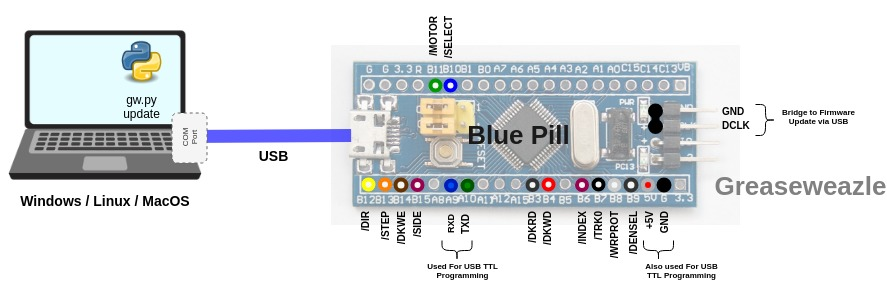

The Greaseweazle host tools may sometimes require newer firmware
to be programmed into the Greaseweazle device.

Firmware update requires no hardware jumper (except the F1 model, discussed
separately [below](#f1-update-procedure)).
Simply run the update command on your host PC, for example:
```
gw update
```

In the unlikely event that your Greaseweazle is not recognised by your
PC, or otherwise fails to accept the update command, you can force
Greaseweazle into update mode:
- Disconnect USB
- Place a jumper across the **TXO/RXI** pins of the **UART** header
- Connect to USB
- Run the update command
- Disconnect USB and remove the jumper

It is also possible, but not generally recommended, to
[update the bootloader](#bootloader-update-procedure).

## F1 Update Procedure

Before connecting Greaseweazle F1 to your host PC, install a jumper across
**GND** and **DCLK** pins on the 4-pin header situated at one end of the
Blue Pill board, as indicated in the following diagram.



When you connect Greaseweazle it will now run its built-in
**Update Bootloader**. You can update the firmware to the latest
version from the host PC:
```
gw update
```

On report of successful update you should disconnect Greaseweazle
and then remove the Programming Jumper (**DCLK**-**GND**).

[hires]: https://github.com/keirf/greaseweazle/wiki/assets/dupont.jpg

## Bootloader Update Procedure

**WARNING: An error while updating the bootloader firmware can
brick your device, and require full manual
[Firmware Reprogramming](Firmware-Programming)!!**

Note that it is **NOT** usually necessary to update your bootloader.
Unlike the main firmware it does not need to be version-matched to the
host tools, and it does not sprout new features or bug fixes. If it ain't
broke, don't fix it!

With that said, the process is very similar to a normal update, except that
it is done with the device in normal mode rather than update mode. Thus it
is not necessary to jumper your F1 device.
```
gw update --bootloader
```
