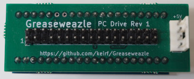
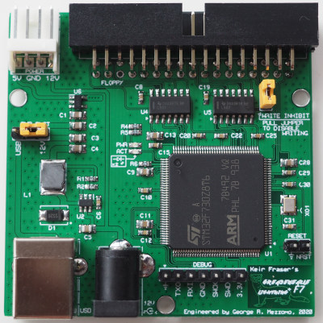
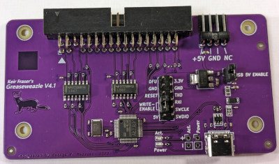
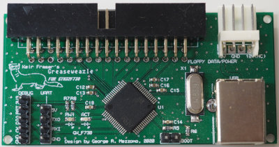
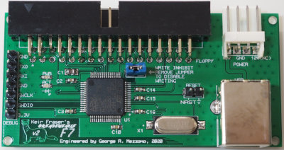
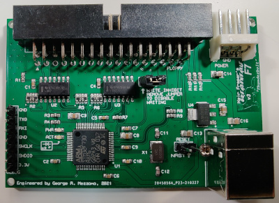
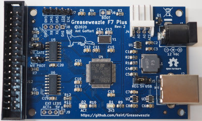
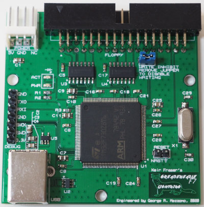
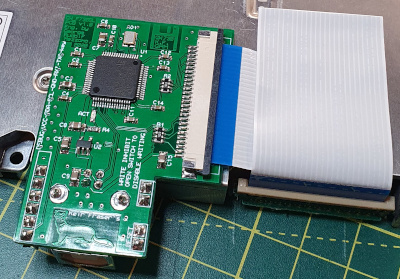
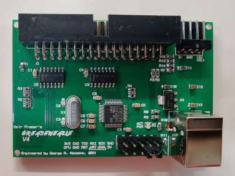

- [Overview](#overview)
- [Features](#features)
- [Gallery](#gallery)
- [Previous Models](#previous-models)

## Overview

There are three MCU lines supported by Greaseweazle, with hardware
identified as follows:
- **F1**: Based on the STM32F103 MCU and the "Blue Pill"
development board.
- **F7**: Based on the STM32F730 MCU and custom PCB,
available in a range of models.
- **V4**: Based on the AT32F4xx MCUs and custom PCB, available in a range
of models.

## Features

**Feature** | F1   | F1 Plus | F7 Lightning Plus | V4.1
------------|------|---------|-------------------|------
Jumperless Update |    | Yes | Yes | Yes
Multiple Drives  |     | Yes | Yes | Yes
Write-Protect Jumper | | Yes | Yes | Yes
Buffered Outputs |     | Yes | Yes | Yes
High-Speed USB   |     |     | Yes |    
12v Power        |     | Yes | Yes |    
Flippy Drive     |     | Yes | Yes | Yes
Disk Change Detect |   | Yes | Yes | Yes
User Outputs | 1 | 3 | 3 | 3

**Multiple Drives:** Allows simultaneous connection
to two PC, or three Shugart, drives on a single ribbon cable. Useful for
cased installations.

**Write-Protect Jumper:** Physically disables write capability, making it
impossible to accidentally overwrite disks during preservation.

**Buffered Outputs:** Higher (40mA) output drive capability, needed for
older floppy drives with strong input pull-ups (resistance <1kOhm).

**High-Speed USB:** 480Mbps bus transfer rate, compared with 12Mbps on
Full-Speed models. Provides greater bandwidth headroom and future
expandability. Not needed for floppy disks up to High Density data rates
(eg 1.44MB PC disks).

**12v Power:** Allows board and drive to be powered from a single 12v
power brick. These models are the only ones to directly support drives
requiring a 12v supply; other models require such drives to be separately
powered.

**Flippy Drive:** Supports [flippy-modded][fmyt] Panasonic drives for reading
5.25" *flippy disks* in a single pass. 

**Disk Change Detect:** Allows disk change signal to be monitored at floppy
interface pin 34. Used by projects such as Rob Smith's
[WinUAE Greaseweazle integration][rsmith].

**User Outputs:** User-configurable outputs. Useful for non-standard
control signals such as *reduced write current* (8" drives).

## Gallery

Model | Picture
------|--------
F1 | 
F7 Lightning Plus | 
V4.1 | 

## Previous Models

These models are no longer available, but continue to be supported
by the Greaseweazle software. [Design files](Design-Files) are
available for DIY makers.

**Feature** | F7 v1 | F7 v2 | F7 v3 | F7 Plus | F7 Lightning | F7 Slim1 | V4 | V4 Slim1
------------|-------|-------|-------|---------|--------------|---------------------|----|---------
Jumperless Update | Yes | Yes | Yes | Yes | Yes | Yes | Yes | Yes
Multiple Drives  | Yes | Yes | Yes | Yes | Yes | | Yes |
Write-Protect Jumper |     | Yes | Yes | Yes | Yes | Yes | Yes | Yes
Buffered Outputs |     | | Yes | Yes | Yes | | Yes |
High-Speed USB   |     | | | | Yes | | |
12v Power | | | | Yes | | | |
Flippy Drive | | | Yes | | | | Yes |
Disk Change Detect | | | Yes | | | Yes | Yes | Yes
User Outputs | 1 | 3 | 3 | 2 | 3 | 0 | 3 | 0
1. Slim models have 26-pin FFC connector, supporting slim-line 3.5-inch
laptop/embedded drives.

Model | Picture
------|--------
F7 v1 | 
F7 v2 | 
F7 v3 | 
F7 Plus | 
F7 Lightning | 
F7 Slim | 
V4 | 

[fmyt]: https://www.youtube.com/watch?v=WcqluH7dEj4
[rsmith]: https://amiga.robsmithdev.co.uk/winuae
