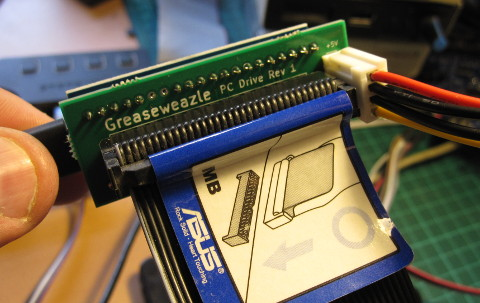

This is the hardware setup page for F1 and F7 models of Greaseweazle. If you
have a **V4** device then please read the [dedicated setup page](V4-Setup).

You should
also read the [**Software Installation**](Software-Installation) page to set up
the control software on your host PC, and peruse the **Usage** pages listed in
the wiki sidebar.

## Greaseweazle Jumper Configuration

Some of the more complex Greaseweazle boards have jumpers which can
configure certain actions:

**WRITE INHIBIT:** Install this jumper to *enable* writes. You can
remove this jumper when preserving disks, to avoid any possibility
of accidental writes.

**PWR SELECT:** On the Lightning Plus a jumper is used to determine
whether the board and floppy-power connector are powered from USB or
from external 12V supply.

Please see the [F7 Plus wiki](https://github.com/aerobaticant/Greaseweazle-F7-Plus/wiki)
for instructions on configuring the F7 Plus.

## Floppy Drive

You can connect Greaseweazle to any floppy drive implementing a
Shugart interface: Old PC 3.5-inch and 5.25-inch drives are a good
choice, or an Amstrad 3-inch drive for Amstrad CPC and Spectrum +3
disks.  Note that, broadly speaking, the drive need not be the same
model as in the system to which the disks belong: a Shugart drive is a
Shugart drive, and it only really matters that it takes the correct
size physical media.

Please also note that GCR formats (as used by Apple II, Mac, and
Commodore 64) can be problematic with some floppy drives due
to the non-standard bitcell timings. Unfortunately finding a compatible
drive can be a matter of trial and error.

### Power

3.5-inch drives typically require only 5v power and can *usually* be
supplied directly from the power header on the Greaseweazle
board. Older 5.25- and 3-inch drives typically are more power hungry
and require 12v power too: These you must connect to a separate power
source, or use a Greaseweazle Plus which accepts an external 12v
supply.

If you have problems accessing your drive via a Greaseweazle you believe
is correctly set up, it can be because the drive requires more power than
it can obtain via USB. In this case try connecting your drive to its own
power supply.

### Drive Terminations

The standard floppy bus is *open collector* with *termination*
(pull-up resistors) at the far receiving end.

The terminations on older 5.25- and 8-inch drives can be as strong as
150 ohms, requiring buffered outputs in the Greaseweazle to
successfully drive these signal lines low. These drives will thus only
work with [buffered models](Greaseweazle-Models) such as F7 Plus and
F7 Lightning Plus. It is also important that only *one* drive in a
bussed setup has 150-ohm terminations: Greaseweazle cannot drive into
multiple strong pull-ups in parallel.

The strong termination in older drives is usually *optional*
because only the last drive on a ribbon cable is expected
to terminate. The terminating resistors on intermediate drives are
traditionally either disabled by a jumper, or removed entirely.
This correctly terminates the signal lines and also prevents overloading
the drive controller's outputs with excessive pull-up current.
However, if termination is missing entirely then the
drive input signals will float (usually at around 2 volts) with unpredictable
results!

1. If using 3.5-inch and 3-inch drives, this is not a concern. Their
terminations are weaker and cannot be disabled.
2. If using a 5.25- or 8-inch drive on its own, make sure that the
termination resistors are present and enabled.
3. If using a 5.25- or 8-inch drive in a multi-drive setup, you probably
do not need the termination resistors.

Note that an unterminated setup will work with other flux boards such
as Kryoflux and Supercard Pro, which actively drive their outputs both
high and low. Greaseweazle by contrast has standard open-collector
outputs which rely on termination resistors to pull signals high.

## Host PC

Connect to your host PC (Linux, Mac, Windows, etc) using a normal USB cable.
Greaseweazle appears as a serial or modem device, depending on your OS.
