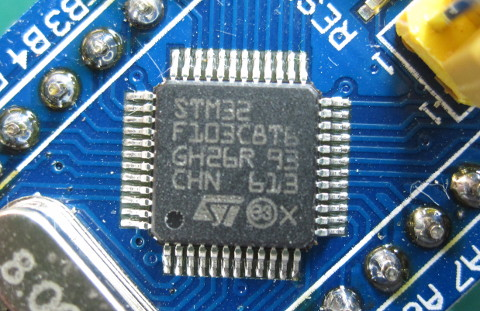
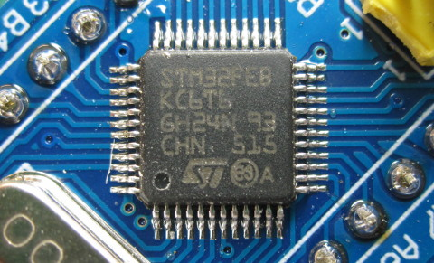
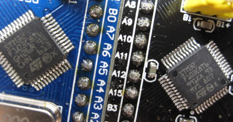
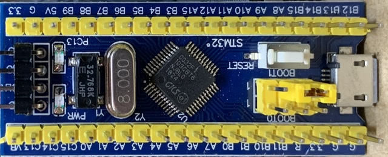

Unfortunately in sourcing STM32 parts outside the proper retail channels
(ie. cheap Chinese sources on Ebay and AliExpress) we need to be aware
of fake chips being sold as STM32F103C8.

On this page I present a [Rogues' Gallery](#rogues-gallery) of fake
parts, describe how they are not equivalent to a proper STM32F103C8
part, and explain how to test your own STM32 parts and "pill"
development boards.

## Testing your Pill

Greaseweazle includes a Blinky test firmware in the **alt/** subfolder.
When written to a correct and working Blue Pill board, this firmware will
flash the PC13 LED once per second (ie. LED toggles every 500ms).

At the same time, a test diagnostic is logged to the serial line at
115200 baud, 8n1. On failure you can use this, if interested, to work out
which parts of the chip are bad or missing. Note that serial output is on
the programming interface at pins **A9** and **A10**: Not via the USB port!

All chips in the [Rogues' Gallery](#rogues-gallery) fail the Blinky test.

## Good STM32F103C8

First note that the chip must have "STM32F103C8" written on it. If the text
says anything different then the part is probably fake, or less powerful,
or both. The text fills the top of the chip, and there is one circular
depression, indicating the pin-1 corner of the chip.

## Rogues' Gallery

### STM32FEBKC6

This chip was found on a Blue Pill sold as "STM32F103C8T6". This chip is
up front about its fakeness: "STM32FEB" is a Chinese clone of the genuine
STM32, while "KC6" indicates a low-density part with missing features.

### Fake STM32F103C8

Harder to spot, this bad fake has been found on cheap Blue and Black Pills
alike. Note the physical differences from a genuine part in the side-by-side
shot below: There are extra circular depressions on the chip surface, and the
writing is smaller. However note that there are also physical variations 
among genuine chips, and the only way to be sure is to run Blinky.

Of course this part fails Blinky. Although it seems to have all the required
peripherals present on the chip, it does not work properly in many ways.
These are differences from the genuine part that I found in my testing:
- Cannot program at 921600 baud. Success at 115200 baud.
- Cannot start firmware from System Bootloader (Bootloader may not set the Reset SP?)
- Debug registers return valid non-zero info (contravenes Erratum 2.3 of genuine parts)
- Writing to backup registers, and then turning off the backup interface clock, seems to lock up parts of the chip: Future writes to certain registers hang forever with no exception or reset
- I2C peripheral won't allow CR1_ACK to be set in the same write that sets CR1_PE
- DMA peripheral generates spurious extra completion interrupts and is generally prone to lockup

## Fakes Which Pass Blinky

### CS32F103

This clone (which probably also appears in remarked chips posing as genuine
STM32F103) actually passes Blinky and seems to work okay in general. Note that
this chip fixes Erratum 2.3 of genuine STM32F103 (return values from debug
registers) and thus can be detected as a clone part.

